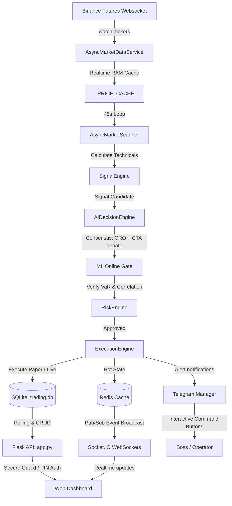

# 🌌 Aurvex AI Trade Engine & Friday AI CEO Operator v6.5

Aurvex AI, Binance Futures üzerinde çalışan, yüksek frekanslı sinyal tarama, çoklu zaman dilimli trend hizalaması, gelişmiş risk yönetimi ve yapay zeka tabanlı otonom yönetim mimarisine sahip **kurumsal düzeyde bir algoritmik ticaret motorudur**. 

Sistem, kendi kendini optimize edebilen Optuna Ghost Learning filtrelerine, makine öğrenmesi destekli karar mekanizmalarına ve tüm sunucu yetkilerine sahip yapay zeka CEO operatörü **Friday**'e ev sahipliği yapar.

---

## 🚀 Öne Çıkan Gelişmiş Özellikler

### 1. 🧠 Friday AI CEO Operatör & Ses Sentezi
* **Otonom CEO Kontrolü:** Claude entegrasyonu sayesinde, Friday sistem verilerini, günlük PnL durumunu ve risk loglarını inceleyerek parametreleri dinamik olarak günceller (örneğin: dalgalı piyasada risk azaltma, otonom pause/resume).
* **Ajanlar Arası Konsensüs (Debate):** Friday karar almadan önce, arka planda **Baş Risk Yöneticisi (CRO)** ve **Baş Teknik Analist (CTA)** Claude ajanlarını yarıştırarak ortak bir konsensüs raporu hazırlar.
* **edge-tts Doğal Ses Sentezi:** Raporları, veto edilen pozisyonları ve sistem kararlarını `tr-TR-EmelNeural` ses modeliyle doğal, cilveli ve akıcı Türkçe ses kayıtlarına dönüştürerek Telegram üzerinden "Sesli Rapor" olarak boss'una iletir.
* **Sunucu Temizliği:** Disk doluluk oranına göre atıl geçici backtest verilerini ve logları tarayıp tek tuşla silmenizi sağlayan otonom temizlik mekanizması.

### 2. 📊 Kantitatif Sinyal & Risk Filtreleri
* **GMM Market Regime Classifier:** Gaussian Mixture Model kullanarak piyasayı *TRENDING*, *CHOPPY* veya *NEUTRAL* olarak etiketler ve stratejiyi rejim tipine göre otomatik adapte eder.
* **CVD Flow & Divergans:** Cumulative Volume Delta eğimlerini hesaplayarak hacimli alım/satım baskısını ve fiyat uyumsuzluklarını süzgeçten geçirir.
* **L2 Order Book Wall Guard:** Emir defterindeki likidite duvarlarını (bids/asks) L2 derinlik analiziyle tarayarak sahte kırılımları (fakeout) engeller.
* **Pearson Korelasyon Kalkanı:** Açık işlemler arasındaki korelasyon matrisini hesaplayarak aynı anda birbirine bağımlı çok sayıda işleme girilmesini engeller ve sepet riskini dağıtır.

### 3. 🛡️ Kelly Criterion & Sharpe/Sortino Risk Bütçeleme
* **Kelly Dinamik Sizing:** Sharpe ve Sortino rasyolarını anlık hesaplayarak kasa büyüklüğüne göre en optimum pozisyon büyüklüğünü Kelly Kriteri ile dinamik olarak 1.3x'e kadar ölçekler.
* **Equity Curve Filter (EMA):** Bakiye gelişim eğrisinin EMA ortalamasının altına inmesi durumunda risk oranını otomatik olarak %50 düşürerek drawdown (kasa erimesi) dönemlerini korumaya alır.
* **Drawdown Circuit Breaker:** Günlük kümülatif kayıp veya drawdown oranları (Defensive %5, Lockout %10) aşıldığında sistemi otonom olarak duraklatır veya kağıt ticareti moduna (Paper Mode) çeker.

### 4. 🔒 Premium Dashboard & PIN Kilit Güvenliği
* **Glassmorphic Lock Screen:** Dashboard'un internete açık olduğu durumlarda yetkisiz erişimi engellemek için premium cam efektli PIN kilit ekranı.
* **Güvenli API & WebSockets:** Tüm API (`/api/*`) ve gerçek zamanlı WebSocket kanalları `X-Dashboard-PIN` başlık ve el sıkışma doğrulamasıyla korunmaktadır.
* **Friday Live Chat:** Dashboard üzerinden Friday ile canlı olarak sohbet edebilir; öneri butonlarını (*Teşhis, Grafik, Rapor, Veto, Temizlik*) kullanarak Friday'in anlık sesli ve görsel raporlar üretmesini sağlayabilirsiniz.

---

## 📐 Sistem Mimarisi ve Veri Akışı



---

## 📂 Klasör ve Kod Yapısı

| Dosya / Dizin | Görev ve Sorumluluk |
| :--- | :--- |
| `app.py` | Flask REST API endpoints, SSE Stream, Socket.IO WebSockets ve PIN auth entegrasyonu |
| `async_scalp_engine.py` | Ana asenkron scalp motoru, Binance WebSocket tarama döngüsü ve Friday CEO periyodik izleme döngüsü |
| `telegram_manager.py` | Telegram komut merkezi, `/friday` interaktif yönetim paneli ve inline buton callback yönlendiricileri |
| `telegram_delivery.py` | Telegram üzerinden metin, ses ve bakiye gelişim grafiği (matplotlib) gönderim paketi |
| `database.py` | SQLite veri tabanı katmanı, WAL modu optimizasyonu, migration motoru ve bakiye defteri logları |
| `core/friday_ceo.py` | Friday AI CEO akıllı operasyon beyni, Claude debate sentezleyicisi, makro kalkanı ve edge-tts entegrasyonu |
| `core/risk_engine.py` | Portföy VaR limiti, Pearson korelasyon engeli ve drawdown devre kesicilerini yöneten ana risk motoru |
| `core/accounting.py` | Sharpe/Sortino rasyoları tabanlı Kelly pozisyon büyüklüğü hesaplama ve bakiye büyümesi loglama katmanı |
| `core/ml_signal_scorer.py` | ML Gating modeli eğitimi (ROC-AUC koruması) ve otonom online öğrenme modeli |
| `core/ghost_learning.py` | Kağıt üzerinde sinyal adaylarının MFE/MAE oranlarını takip eden sanal öğrenme simülatörü |
| `static/` | Dashboard için CSS (`hub.css`, `friday_chat.css`) ve JS (`hub.js`, `friday_chat.js`) premium tasarımları |
| `templates/index.html` | Premium dark-mode glassmorphic HTML gösterge paneli ve Friday chat arayüzü |

---

## ⚙️ Güvenlik ve Canlı Ticaret Ayarları

Sistem varsayılan olarak **Paper Trading** (Sanal Para) modunda başlar. Canlı ticareti (Live) aktif etmek için `.env` dosyasındaki güvenlik parametrelerinin tamamını onaylamanız gereklidir:

| Parametre | Varsayılan Değer | Açıklama |
| :--- | :--- | :--- |
| `EXECUTION_MODE` | `paper` | `live` yapılarak gerçek hesap etkinleştirilir. |
| `LIVE_TRADING_ENABLED` | `False` | Canlı hesap yetki kilidini açar. |
| `CONFIRM_LIVE_TRADING` | `False` | Son onay bariyerini tetikler. |
| `DASHBOARD_PIN` | *(Boş)* | Dashboard girişinde istenecek PIN kodu (örn: `1234`). Boş bırakılırsa koruma pasiftir. |
| `ALLOWED_IPS` | *(Boş)* | Sadece belirli IP adreslerinin dashboard API'lerine bağlanmasına izin verir. |

---

## 🛠️ Kurulum ve Çalıştırma

### 1. Yerel Kurulum (Python)
Gerekli kütüphaneleri yükleyin ve `.env` dosyasını oluşturun:
```bash
pip install -r requirements.txt
cp .env.example .env
```
`.env` dosyasını açıp `BINANCE_API_KEY`, `TELEGRAM_BOT_TOKEN`, `TELEGRAM_CHAT_ID`, `ANTHROPIC_API_KEY` ve `DASHBOARD_PIN` değerlerinizi girin.

### 2. Başlatma
* **Web Arayüzü ve API'yi Başlatın:**
  ```bash
  python app.py
  ```
* **Scalp Robotunu ve Friday'i Başlatın:**
  ```bash
  python async_scalp_engine.py
  ```

### 3. Docker ile Başlatma (Tavsiye Edilen)
Projeyi docker-compose ile izole ve optimize bir şekilde çalıştırabilirsiniz:
```bash
docker-compose up -d --build
```

---

## 🧪 Testler ve Sağlık Kontrolü

Sistem kalitesini korumak için entegre test paketlerini ve derin sağlık tarama aracını kullanabilirsiniz:

* **Derin Teşhis ve Sağlık Kontrolünü Çalıştırın:**
  ```bash
  python health_check.py
  ```
  *(Çıktıda 0 FAIL ve 39 OK sonucu alınmalıdır)*

* **Dashboard ve Telegram API Entegrasyon Testlerini Çalıştırın:**
  ```bash
  python -m unittest tests/test_dashboard_telegram_audit.py
  ```

* **Hiperparametre ve Otonom Testleri Çalıştırın:**
  ```bash
  python -m unittest tests/test_phase_g_quantum.py
  ```
