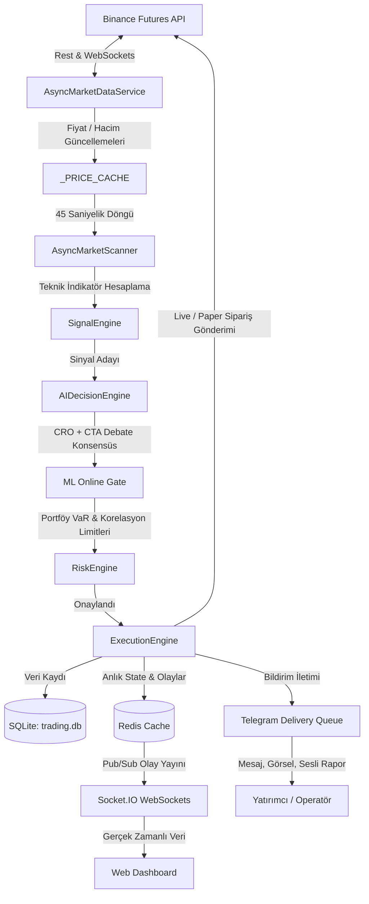

# 🌌 Aurvex AI Trading Engine — Sistem Mimarisi

Bu doküman, Aurvex platformunun genel mimari yapısını, thread modellerini, servis katmanlarını ve sistem bileşenleri arasındaki ilişkileri detaylandırır.

---

## Mimarinin Genel Yapısı

Aurvex; asenkron veri toplama, gerçek zamanlı sinyal işleme, otonom AI karar mekanizmaları, katı risk kontrolü ve otonom bir CEO operatöründen oluşan **kurumsal düzeyde bir algoritmik ticaret motorudur**. Sistem, yüksek frekansta çalışabilecek şekilde optimize edilmiş asenkron event-driven (olay güdümlü) bir mimariye sahiptir.

---

## Temel Servis Katmanları ve Görevleri

### 1. Market Veri Katmanı (Data Ingestion)
- **Modüller**: `core/market_data.py`, `async_scalp_engine.py` (WebSocket Ticker Stream).
- **Açıklama**: Binance Futures üzerinden anlık fiyat, order book ve son işlemler verilerini toplar. Bellek içi hızlı bir önbellekte (`_PRICE_CACHE`) saklar.

### 2. Sinyal Tarama ve Karar Katmanı (Scanner & Signals)
- **Modüller**: `async_scalp_engine.py`, `core/trend_engine.py`, `core/trigger_engine.py`, `core/ai_decision_engine.py`.
- **Açıklama**: Belirli periyotlarla (örn. 45 saniye) tüm coin çiftlerini tarar. Teknik formasyonları (CVD, RSI, Bollinger vb.) ve fiyat rejimlerini hesaplar. Karar motoru (Debate) CTA ve CRO yapay zeka ajanlarını yarıştırarak sinyali onaylar veya veto eder.

### 3. Risk ve Bütçeleme Katmanı (Risk & Accounting)
- **Modüller**: `core/risk_engine.py`, `core/portfolio_risk.py`, `core/accounting.py`.
- **Açıklama**: Portföy riskini yönetir. Kelly Kriterine göre dinamik pozisyon büyüklüğünü hesaplar. Korelasyon kalkanı ve Value-at-Risk (%99 VaR) kısıtlamalarını uygulayarak riski sınırlar. Drawdown devre kesicilerini yönetir.

### 4. İşlem Gönderim ve Takip Katmanı (Execution & Tracking)
- **Modüller**: `execution_engine.py`, `core/live_execution.py`, `core/trailing_engine.py`, `core/paper_tracker.py`.
- **Açıklama**: Limit kovalamalı emir tipiyle (Limit Chase) Binance üzerinde pozisyonları açar/kapatır. Breakeven ve trailing stopları dinamik günceller. Kağıt üzerinde de MFE/MAE takibi yapar.

### 5. Kullanıcı Etkileşimi ve Bildirim Katmanı (Interfaces & Delivery)
- **Modüller**: `app.py`, `websocket_events.py`, `telegram_delivery.py`, `telegram_manager.py`.
- **Açıklama**: Flask Web sunucusu, Socket.IO websocket'leri ve Telegram Bot entegrasyonu. Tüm olaylar gerçek zamanlı olarak dashboard'a ve Telegram üzerinden boss'a raporlanır.

---

## Threading ve Concurrency Modeli

Aurvex, çoklu iş parçacığı (multi-threading) kullanarak farklı süreçlerin birbirini engellemesini önler:
1. **Ana Asenkron Event Loop (asyncio)**: WebSocket bağlantılarını, pazar taramalarını ve WebSocket olay yayınlarını tek bir asenkron döngüde yönetir.
2. **Flask Web Thread'leri**: Kullanıcı isteklerini karşılar ve websocket istemcilerine veri yayınlar.
3. **Telegram Worker Thread**: Mesaj gönderimlerini kuyruktan bağımsız bir şekilde işler. Kilitlenme önleyici optimizasyonlarla donatılmıştır.
4. **Watchdog & Supervisor Thread'leri**: Arka planda çalışan servislerin sağlık durumunu periyodik olarak izler ve kilitlenen thread'leri otomatik yeniden başlatır.
